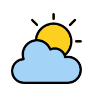
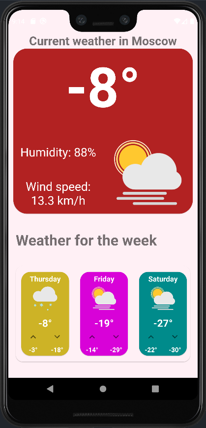
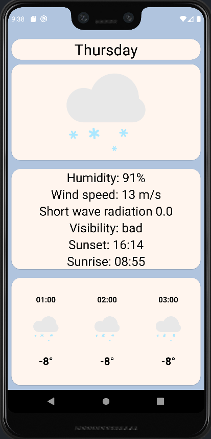
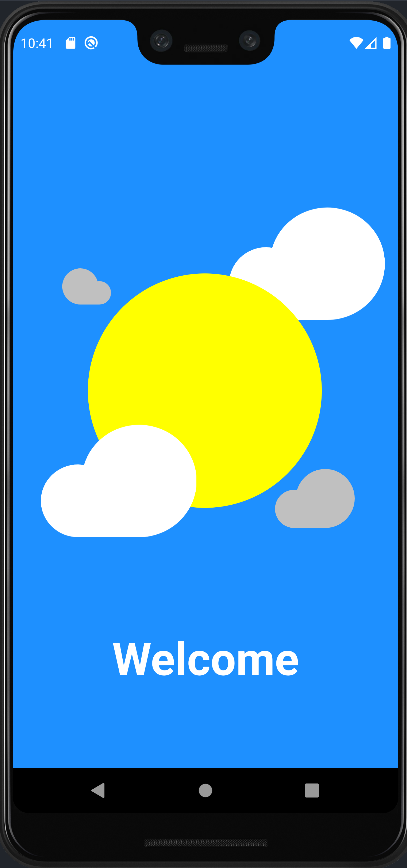
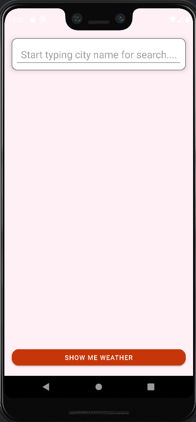

# Your weather

 

## Screenchots

## Highlights

- Use [open-meteo](https://open-meteo.com/en/docs) Api
- Use Material Design 2
- Support one language: English 
- Use locale Database

## Description

 Your weather is an application that demonstrates my skills as an android developer. The following technologies and libraries were used in this project: viewBinding, Fragments, ViewModels, Dagger2, RoonDatabase, Retrofit 2, LiveData, Clean Architecture, Picasso, RxAnimations.

## Technologies used
* Kotlin
* MVVM
* Retrofit & RxJava
* RxAnimations
* Android Architecture Components
* Picasso
* Kotlin Coroutines
* Dagger 2
* RoomDatabase